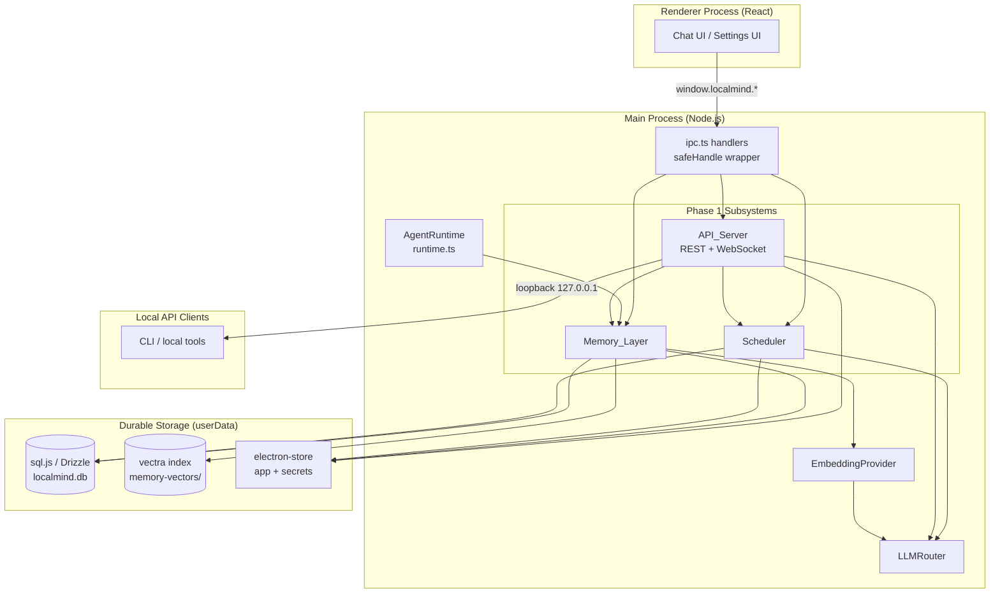
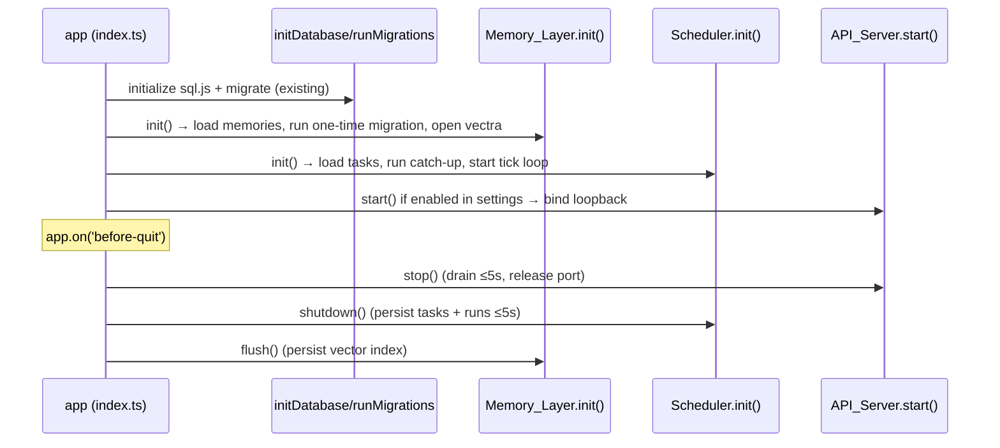

# Design Document

## Overview

This design specifies **Phase 1 — Foundation** of evolving LocalMind into an "AI Operating System." It introduces three new subsystems into the existing Electron main process while preserving every current contract:

1. **Memory_Layer** — a persistent, embedding-backed cross-session memory subsystem that extends the existing SQLite `memories` table with a local Vector_Store, semantic/lexical/hybrid recall, and full management operations (Requirements 1–5, 13, 15, 16, 17).
2. **Scheduler** — a background task scheduler running entirely in the main process that supports cron, interval, and one-time triggers with durable task and run history (Requirements 6–8, 13, 15, 16).
3. **API_Server** — a loopback-bound REST + WebSocket server with bearer-token authentication that exposes chat, memory, and scheduler operations to local clients (Requirements 9–12, 13, 14, 15, 16).

### Guiding Principles

- **Extend, do not replace.** All three subsystems are additive. The existing IPC handlers, `safeHandle()` wrapper, sql.js + Drizzle persistence, `electron-store` settings, and lexical recall in `runtime.ts` remain the foundation (Req 17).
- **Local-only by default.** Embeddings, the Vector_Store, and the API server all operate on-device. Privacy_Mode forces local-only embedding and inference (Req 13).
- **Graceful degradation.** Every embedding/semantic path has a lexical fallback. Every durable subsystem can fail to load without preventing the rest of LocalMind from starting (Req 2, 3, 16).
- **Reuse existing primitives.** Reuse `IPCResponse`/`safeHandle()`, `db`/`persistDatabase()`, `appStore`, `getSecret`/`setSecret`, and `llmRouter` rather than introducing parallel mechanisms.

### Technology Decisions

| Concern | Decision | Rationale |
|---|---|---|
| Vector_Store | **`vectra`** (already a dependency) | Pure-JS, file-backed local vector index. No native build, no cloud calls — satisfies privacy-first (Req 13.1). Chosen over Mem0 (cloud-oriented) and LanceDB (native binary) which conflict with the local-only/no-native-deps posture of the existing sql.js stack. |
| Embeddings | **Ollama `/api/embeddings`** via a new `EmbeddingProvider` abstraction | Local model honors Privacy_Mode (Req 3.5, 13.3). Abstraction allows a configured cloud embedding model when Privacy_Mode is off. |
| Cron parsing | **`croner`** (new dependency) | Zero-dependency, well-maintained 5-field cron parser with `nextRun()` support. |
| HTTP/WS server | Node built-in `http` + **`ws`** (new dependency) | Minimal surface, loopback binding control, mature WebSocket support. |
| Payload validation | **`zod`** (already a dependency) | Schema validation for REST/WS payloads (Req 10.8). |
| Property testing | **`fast-check`** + Vitest (new dev dependency) | Standard PBT library for the TS/Vitest stack already in use. |

---

## Architecture

### System Context



### Process & Lifecycle Integration

All three subsystems are owned by the main process and wired into the existing `src/main/index.ts` lifecycle:



Each `init()` is independently fault-isolated: a failure in one subsystem is logged and reported but does not abort startup of the others (Req 16.3, 9.4, 2.2).

### Threading / Non-Blocking Model

The main process is single-threaded for JS. To satisfy non-blocking requirements (Req 15.2, 15.3):

- **Embedding generation is fire-and-forget**: writes persist content synchronously, then an embedding job is enqueued on an async micro-queue; recall and chat never await embedding generation (Req 3.1, 15.2).
- **Scheduler tick** uses a `setInterval` evaluation loop (≤60s, default ~15s) and dispatches task execution via `setImmediate`/async functions so trigger evaluation never blocks IPC handlers (Req 7.2, 15.3).
- **API non-LLM operations** are thin async wrappers around in-memory/Drizzle calls, beginning work within 100ms (Req 15.4).

---

## Components and Interfaces

### Component 1: Memory_Layer (`src/main/memory/`)

```
src/main/memory/
  memory-service.ts     → MemoryService facade (public API used by IPC, runtime, API server)
  vector-store.ts       → VectraVectorStore wrapper (add/query/delete embeddings)
  embedding-provider.ts → EmbeddingProvider (Ollama-backed; cloud-capable)
  recall.ts             → pure ranking functions: cosineSimilarity, lexicalScore, hybridRank
  migration.ts          → one-time App_Store → Memory_Layer migration
  embedding-queue.ts    → async embedding job queue (non-blocking)
  types.ts
```

#### MemoryService interface

```typescript
interface MemoryRecord {
  id: string
  kind: string                       // 'semantic' | 'summary'
  content: string
  importanceScore: number
  sourceConversationId: string | null
  enabled: boolean
  hasEmbedding: boolean              // derived: embedding present in vector store
  needsEmbedding: boolean           // flagged when content changed but embedding stale
  createdAt: number
  updatedAt: number
}

interface RecallOptions {
  limit?: number                     // 1..50, default 5 (Req 4.4)
  timeoutMs?: number                 // default 2000 (Req 4.8)
}

interface RecallResult {
  record: MemoryRecord
  score: number
  mode: 'semantic' | 'lexical' | 'hybrid'
}

interface MemoryService {
  init(): Promise<void>                                  // Req 1.4, 2.1, 2.4, 2.5
  create(input: { content: string; kind?: string; sourceConversationId?: string }): Promise<MemoryRecord>  // Req 1.2, 3.1
  update(id: string, content: string): Promise<MemoryRecord>   // Req 5.4–5.7
  delete(id: string): Promise<void>                      // Req 5.2, 5.3
  setEnabled(id: string, enabled: boolean): Promise<MemoryRecord>  // Req 5.8, 5.9
  list(): Promise<MemoryRecord[]>                        // Req 5.1
  recall(query: string, opts?: RecallOptions): Promise<RecallResult[]>  // Req 4.*
  flush(): Promise<void>                                 // persist vector index on shutdown
}
```

**Write durability (Req 1.2, 1.3, 1.6):** `create`/`update` write the SQLite row, call `persistDatabase()`, and only then resolve. The write is wrapped in a 5-second timeout; on timeout or error the operation returns a failed `IPCResponse` and rolls back the in-memory row so no partial record is persisted (Req 1.3, 1.6). The vector index write is decoupled — content durability never depends on embedding success.

**Recall flow (Req 4.1–4.8):**
1. Load enabled candidate records (`enabled = true`) — disabled records are excluded at query time (Req 4.5, 5.8, 2.8).
2. If the query can be embedded AND stored embeddings exist → compute semantic scores; additionally compute lexical scores; combine into a Hybrid_Recall ranking when both signals are present (Req 4.2, 4.6). If only one signal is available, use it alone (Req 4.3).
3. Sort by descending combined score, ties broken by most-recent `createdAt` first (Req 4.1).
4. Truncate to `limit` (clamped to 1..50, default 5) (Req 4.4).
5. Return within `timeoutMs` (default 2000); on timeout, return best-available lexical results rather than erroring (Req 4.8, 4.7).

**Runtime integration:** `AgentRuntime.queryLexicalMemory()` is replaced by a call to `MemoryService.recall()`. The existing lexical algorithm is preserved inside `recall.ts` as the fallback path (Req 17.2). The injected system-prompt format is unchanged.

#### EmbeddingProvider interface

```typescript
interface EmbeddingProvider {
  isAvailable(): Promise<boolean>
  isLocal(): boolean                                   // true for Ollama
  embed(text: string): Promise<number[]>               // throws on failure/timeout
}
```

- Under Privacy_Mode, only a local (Ollama) provider is selectable; if none is reachable, embedding is skipped and content remains lexical-only (Req 3.5, 3.6, 13.3).
- Requests time out at 30s; embedding generation is retried up to 3 consecutive attempts before marking the record embedding-absent (Req 3.2, 3.7).

### Component 2: Scheduler (`src/main/scheduler/`)

```
src/main/scheduler/
  scheduler-service.ts  → SchedulerService facade
  trigger.ts            → pure trigger parsing/validation + nextRunAt computation
  task-runner.ts        → executes a task type, produces a Task_Run
  task-registry.ts      → in-memory map of tasks ↔ next-fire times
  types.ts
```

#### Trigger model & SchedulerService interface

```typescript
type Trigger =
  | { type: 'cron'; expression: string }                       // 5-field (Req 6.2)
  | { type: 'interval'; seconds: number }                      // 1..31_536_000 (Req 6.2)
  | { type: 'once'; timestamp: number }                        // one-time (Req 6.2)

type TaskType = 'chat_prompt' | 'memory_summarize' | 'webhook' | string
type RunStatus = 'succeeded' | 'failed'
type RecentRunStatus = 'not-yet-run' | 'running' | 'succeeded' | 'failed'

interface ScheduledTask {
  id: string
  type: TaskType
  trigger: Trigger
  params: Record<string, unknown>
  enabled: boolean
  createdAt: number
  updatedAt: number
}

interface TaskRun {
  id: string
  taskId: string
  status: RunStatus
  startedAt: number
  endedAt: number
  result: string | null
  error: string | null
}

interface SchedulerService {
  init(): Promise<void>                                          // Req 6.4, 7.7
  register(input: { type: TaskType; trigger: Trigger; params?: object }): Promise<ScheduledTask>  // Req 6.1, 6.3, 6.5
  list(): Promise<Array<ScheduledTask & { lastRunStatus: RecentRunStatus }>>  // Req 8.1
  setEnabled(id: string, enabled: boolean): Promise<ScheduledTask>            // Req 8.2, 8.3, 8.5
  updateTrigger(id: string, trigger: Trigger): Promise<ScheduledTask>        // Req 8.6, 8.7, 8.5
  remove(id: string): Promise<void>                              // Req 8.4, 8.5
  listRuns(taskId: string): Promise<TaskRun[]>
  shutdown(): Promise<void>                                      // Req 8.8
}
```

**Evaluation loop (Req 7.1, 7.2):** A `setInterval` tick (default 15s, configurable, capped at 60s) evaluates every enabled task's `nextRunAt`. Due tasks are dispatched concurrently, each isolated in its own `try/catch`, so one failure cannot block others (Req 7.4, 7.6). Each execution creates exactly one Task_Run with status `succeeded` or `failed` (Req 7.3).

**Catch-up on startup (Req 7.7):** During `init()`, the scheduler compares each task's last run / `nextRunAt` against now. Any cron/interval task whose fire time elapsed while the process was down is executed within 5s of detection. One-time tasks that already have a Task_Run are never re-executed (Req 7.5).

**Lifecycle (Req 8.4, 8.8):** `remove` cancels the in-memory next-fire entry and marks any in-progress run for that task as not recordable as `succeeded`. `shutdown` flushes all task and run state to disk within 5s.

**Privacy parity (Req 13.4):** Task execution routes through the same `LLMRouter` and reads `privacyMode` from `appStore`, inheriting identical provider restrictions as interactive chat.

### Component 3: API_Server (`src/main/api/`)

```
src/main/api/
  api-server.ts     → lifecycle: start/stop, loopback bind, port validation
  auth.ts           → bearer-token middleware, constant-time compare, origin allow-list
  rate-limiter.ts   → per-client token-bucket (Req 14.3)
  rest-routes.ts    → REST endpoints → MemoryService/SchedulerService/LLMRouter
  ws-handler.ts     → WebSocket streaming bridge
  schemas.ts        → zod request schemas (Req 10.8)
  types.ts
```

#### Lifecycle (Req 9.*)

```typescript
interface ApiServerConfig {
  enabled: boolean
  host: string          // default '127.0.0.1'; non-loopback only via explicit opt-in (Req 13.2)
  port: number          // 1024..65535 (Req 9.5)
  allowedOrigins: string[]
  maxBodyBytes: number  // Req 14.4
  rateLimit: { windowMs: number; max: number }  // Req 14.3
}

interface ApiServer {
  start(config: ApiServerConfig): Promise<{ host: string; port: number }>  // Req 9.1–9.5
  stop(): Promise<void>                                                     // Req 9.6
  isListening(): boolean
}
```

- Validates port range before binding; out-of-range → configuration error, no bind (Req 9.5).
- Binds exclusively to the loopback host unless explicit non-loopback opt-in is set (Req 9.2, 13.2).
- On successful listen, writes `{ host, port }` to `appStore` within 1s so the renderer can read it (Req 9.3).
- Port-in-use → abort own startup, report conflict, leave rest of app operational (Req 9.4).
- `stop()` stops accepting connections, drains in-flight requests up to 5s, then force-closes and releases the port (Req 9.6).

#### Authentication & access control (Req 10.*, 14.*)

- Every REST request and WS handshake must carry an API_Token (`Authorization: Bearer <token>`) that exactly matches the token in the Secrets_Store, compared with a constant-time function (Req 10.1).
- Missing/invalid token → REST 401 / WS handshake 401, operation not performed, token never echoed (Req 10.2, 10.3, 10.4).
- Token regeneration produces a ≥32-char token, replaces the stored token, and invalidates the prior token within 1s (Req 10.5, 10.6).
- Cross-origin requests with an origin not in the allow-list → 403 (Req 10.7).
- Malformed/invalid payloads (zod failure) → 400 (Req 10.8). Oversized payloads → 413 (Req 14.4). Rate-limit exceeded → 429 (Req 14.3).
- The token is stored only in Secrets_Store and never written to logs (Req 14.1).

#### REST endpoints (Req 11.*)

| Method | Path | Maps to | Requirement |
|---|---|---|---|
| POST | `/v1/chat/completions` | `LLMRouter.complete` (non-stream) | 11.1, 11.2 |
| GET | `/v1/memories` | `MemoryService.list` | 11.3 |
| POST | `/v1/memories` | `MemoryService.create` | 11.3 |
| PATCH | `/v1/memories/:id` | `MemoryService.update`/`setEnabled` | 11.3 |
| DELETE | `/v1/memories/:id` | `MemoryService.delete` | 11.3 |
| GET | `/v1/tasks` | `SchedulerService.list` | 11.4 |
| POST | `/v1/tasks` | `SchedulerService.register` | 11.4 |
| DELETE | `/v1/tasks/:id` | `SchedulerService.remove` | 11.4 |

Every REST response is serialized as an `IPCResponse` object: `{ success: boolean, data?, error? }` (Req 11.5). Privacy_Mode blocks non-Ollama routing with a failed `IPCResponse` (Req 11.2). Auth failures short-circuit before any subsystem is invoked (Req 11.6). Downstream failures return `success:false` and leave stored data unchanged (Req 11.7).

#### WebSocket streaming (Req 12.*)

A single WS endpoint (`/v1/stream`) authenticated at handshake. Message protocol:

```typescript
// client → server
{ type: 'chat.start'; streamId: string; request: LLMRequest }
{ type: 'chat.cancel'; streamId: string }
// server → client
{ type: 'chunk'; streamId: string; delta: string }            // Req 12.1
{ type: 'done'; streamId: string; usage: TokenUsage }         // Req 12.4 (prompt/completion/total)
{ type: 'error'; streamId: string; error: string }            // Req 12.5
```

Chunks are emitted in production order tagged with `streamId` (Req 12.1). First chunk within 30s of acceptance; each subsequent chunk within 30s of production (Req 12.2). Unauthenticated stream requests send no chunks and close (Req 12.3). Cancellation stops chunks within 5s and closes the stream (Req 12.6), reusing the existing `AbortController` cancellation already present in `AgentRuntime`. Connection loss aborts the associated generation within 30s (Req 12.7).

### Settings & IPC surface (renderer-facing)

New `appStore` keys (all additive, defaults keep existing behavior unchanged — Req 17.3):

```typescript
memoryConfig?: { recallLimit: number; recallTimeoutMs: number; embeddingProvider: string | null; embeddingModel: string | null }
schedulerConfig?: { tickIntervalMs: number; runRetentionDays: number }
apiServer?: ApiServerConfig
apiServerRuntime?: { host: string; port: number } | null   // written on listen (Req 9.3)
```

New IPC namespaces (registered via `safeHandle`, mirrored in preload + `src/shared/types/localmind-api.ts`): `window.localmind.memory.*`, `.scheduler.*`, `.apiServer.*`. The existing memory handling in `ipc.ts` (`getMemorySystemPrompt`, App_Store memories) remains until migration completes, preserving current renderer behavior (Req 17.1).

---

## Data Models

### Extended `memories` table (Drizzle, additive columns)

The existing table is preserved; new columns are added idempotently via the existing `PRAGMA table_info` ALTER pattern in `runMigrations()` (Req 17.4, 2.1).

```typescript
export const memories = sqliteTable('memories', {
  id: text('id').primaryKey(),
  kind: text('kind').notNull(),
  content: text('content').notNull(),
  importanceScore: real('importance_score').default(0.5),
  sourceConversationId: text('source_conversation_id').references(() => conversations.id),
  enabled: integer('enabled', { mode: 'boolean' }).default(true),
  // NEW (additive):
  embeddingModel: text('embedding_model'),        // model used to produce the stored vector, null if none
  embeddingStatus: text('embedding_status').default('absent'), // 'absent' | 'present' | 'stale' (Req 3.2, 5.6)
  createdAt: integer('created_at').notNull(),
  updatedAt: integer('updated_at').notNull(),
})
```

The embedding **vector** is stored in the vectra index (not SQLite), keyed by the memory `id` so it is retrievable by identifier (Req 3.3) and removable on delete (Req 5.2).

### `scheduled_tasks` table (new)

```typescript
export const scheduledTasks = sqliteTable('scheduled_tasks', {
  id: text('id').primaryKey(),
  type: text('type').notNull(),
  triggerJson: text('trigger_json').notNull(),     // serialized Trigger
  paramsJson: text('params_json'),
  enabled: integer('enabled', { mode: 'boolean' }).default(true),
  nextRunAt: integer('next_run_at'),               // computed fire time, null when not scheduled
  lastRunAt: integer('last_run_at'),
  createdAt: integer('created_at').notNull(),
  updatedAt: integer('updated_at').notNull(),
})
```

### `task_runs` table (new)

```typescript
export const taskRuns = sqliteTable('task_runs', {
  id: text('id').primaryKey(),
  taskId: text('task_id').references(() => scheduledTasks.id).notNull(),
  status: text('status').notNull(),               // 'succeeded' | 'failed' (Req 7.3)
  startedAt: integer('started_at').notNull(),
  endedAt: integer('ended_at').notNull(),
  result: text('result'),
  error: text('error'),
})
```

Task_Run history retention is enforced by a configurable retention period (`runRetentionDays`); rows older than the window are pruned (Req 16.4).

### Vector index (vectra, on disk)

Stored under `userData/memory-vectors/`. Each item: `{ id: memoryId, vector: number[], metadata: { model: string } }`. The index is a local file, never transmitted off-device (Req 13.1, 16.1).

### Persistence locations (Req 16.1)

| State | Location |
|---|---|
| Memory records, scheduled tasks, task runs | `userData/localmind.db` (sql.js, via `persistDatabase()`) |
| Memory embedding vectors | `userData/memory-vectors/` (vectra) |
| API_Token | Secrets_Store (`localmind-secrets`, encrypted) |
| Subsystem config + `apiServerRuntime` | `electron-store` app settings |

### Migration model (Req 2.4, 2.5)

A migration flag (`memoryLayerMigrated` in `appStore`) guards a one-time import of App_Store `memories` and `shortTermMemories` into the `memories` table. The migration is idempotent: each source item is matched by normalized content + source so re-running produces no duplicates, and an interrupted migration resumes safely because already-imported items are detected and skipped (Req 2.4, 2.5). This supersedes the existing `migrateSettingsMemory()` in `runtime.ts`.

---

## Error Handling

All errors surface through the existing `IPCResponse` shape (`{ success: false, error }`) for IPC/REST callers, and through structured `error` events for WebSocket clients. Each subsystem is fault-isolated so a failure in one never aborts the others (Req 16.3).

### Memory_Layer

| Failure | Handling | Requirement |
|---|---|---|
| SQLite write times out (>5s) or throws | Roll back the in-memory row, return `{ success:false, error }`, leave committed records unchanged | 1.3, 1.6 |
| Embedding provider unreachable / no provider | Persist content, set `embeddingStatus = 'absent'`, serve via Lexical_Recall | 3.4, 3.6 |
| Embedding request times out (>30s) or fails 3× | Abort embedding, keep content, mark embedding absent; never blocks chat | 3.2, 3.7 |
| Recall exceeds `timeoutMs` | Return best-available lexical results instead of erroring | 4.8 |
| Mutation on unknown id | No state change, return not-found error | 5.3 |
| Content empty or >10,000 chars | Reject update, retain existing content, return length-violation error | 5.7 |
| Vector index corrupt/unreadable at startup | Log, continue lexical-only, allow rest of app to start | 16.3, 2.2 |

### Scheduler

| Failure | Handling | Requirement |
|---|---|---|
| Invalid trigger / missing task type on register | Reject, store nothing partial, return field-level error | 6.3 |
| Invalid trigger on update | Reject, retain existing trigger, return error | 8.7 |
| Task execution throws | Record Task_Run `failed` with error description, preserve prior runs, continue evaluating others | 7.4, 7.6 |
| Lifecycle op on unknown id | No change, return not-found error | 8.5 |
| Task store corrupt at startup | Log, start with empty registry, allow rest of app to start | 16.3 |

### API_Server

| Failure | Status | Requirement |
|---|---|---|
| Missing/invalid token (REST) | 401, operation not performed, token never echoed | 10.2, 10.4 |
| Missing/invalid token (WS handshake) | 401, connection not established | 10.3 |
| Disallowed cross-origin | 403 | 10.7 |
| Malformed/invalid payload (zod) | 400 | 10.8 |
| Payload exceeds `maxBodyBytes` | 413 | 14.4 |
| Rate limit exceeded | 429 until window resets | 14.3 |
| Privacy_Mode blocks non-Ollama route | `{ success:false, error }` (no provider invoked) | 11.2 |
| Port in use at start | Abort own start, report conflict, rest of app operational | 9.4 |
| Port out of 1024–65535 | Config error, no bind | 9.5 |
| WS connection lost mid-stream | Abort generation within 30s | 12.7 |

## Correctness Properties

These invariants are the basis for the property-based tests below.

### Property 1: Recall excludes disabled records
For any store state and query, no record with `enabled = false` appears in `recall()` results.
**Validates: Requirements 4.5, 5.8**

### Property 2: Recall result size bound
`recall()` returns at most `clamp(limit, 1, 50)` results, default 5.
**Validates: Requirements 4.4**

### Property 3: Recall ordering
Results are sorted by descending score; equal scores are ordered by most-recent `createdAt` first.
**Validates: Requirements 4.1**

### Property 4: Lexical fallback totality
When no embeddings are available, `recall()` still returns a valid (possibly empty) ranked list and never throws.
**Validates: Requirements 4.3, 4.7**

### Property 5: Migration idempotency
Running migration N≥1 times yields the same set of memory records as running it once (no duplicates), and the migrated count equals the source count.
**Validates: Requirements 2.4, 2.5**

### Property 6: Content durability independent of embeddings
A successful `create`/`update` persists content regardless of embedding success or failure.
**Validates: Requirements 1.2, 3.4**

### Property 7: Trigger validity
`validateTrigger` accepts exactly: 5-field cron, interval in 1..31,536,000, and one-time timestamp; everything else is rejected.
**Validates: Requirements 6.2, 6.3**

### Property 8: One-time tasks fire at most once
A `once` task that already has a Task_Run is never executed again across ticks and restarts.
**Validates: Requirements 7.5**

### Property 9: Failure isolation
Given a batch of due tasks where some throw, every non-throwing task still produces a `succeeded` Task_Run.
**Validates: Requirements 7.6**

### Property 10: Token comparison is total and constant-time
Auth accepts only an exact match of the stored token; any other input is rejected.
**Validates: Requirements 10.1**

### Property 11: Response envelope
Every REST response is a well-formed `IPCResponse` with `data` present iff `success` is true and `error` present iff `success` is false.
**Validates: Requirements 11.5**

## Testing Strategy

Tests use **Vitest** (existing `npm run test:unit`) plus **fast-check** for property-based tests. The pure ranking/trigger/auth functions are designed to be testable without Electron.

### Unit tests
- `recall.ts`: `cosineSimilarity`, `lexicalScore`, `hybridRank` — known-vector fixtures; ordering and tie-breaking.
- `trigger.ts`: `validateTrigger` accept/reject tables; `nextRunAt` for cron/interval/once.
- `auth.ts`: constant-time compare accepts exact token, rejects empty/wrong/prefix tokens.
- `migration.ts`: maps App_Store memories to records; skips duplicates on re-run.
- `rate-limiter.ts`: allows up to `max`, rejects beyond, resets after window.

### Property-based tests (fast-check)
- Properties 1–4 (recall): random stores (mixed enabled/embedding states) + random queries → assert exclusion, size bound, ordering, totality.
- Property 5 (migration idempotency): random source memory sets, run migration 1..3 times → identical record set.
- Property 7 (trigger validity): random structured/garbage triggers → `validateTrigger` matches the spec predicate.
- Property 9 (failure isolation): random due-task batches with random throwers → all non-throwers produce `succeeded` runs.

### Integration tests
- Memory write→persist→reload survives a simulated restart (re-open DB) (Req 1.1, 1.4).
- Scheduler catch-up: seed an elapsed cron/interval task, `init()`, assert a Task_Run is created (Req 7.7); seed an already-run `once` task, assert no new run (Req 7.5).
- API_Server: start on loopback, assert 401 without token, 200/`success` with token, 403 disallowed origin, 413 oversized body, 429 over rate limit; WS stream emits ordered `chunk`→`done`, and `chat.cancel` stops chunks (Req 9–12).
- Privacy_Mode parity: with Privacy_Mode on, REST chat to a non-Ollama provider returns `success:false` (Req 11.2).

### Regression / backward-compatibility
- Existing memory IPC contracts and `getMemorySystemPrompt` behavior unchanged with feature flags disabled (Req 17.1, 17.3).
- `runMigrations()` additive ALTERs are idempotent across repeated startups (Req 17.4).
