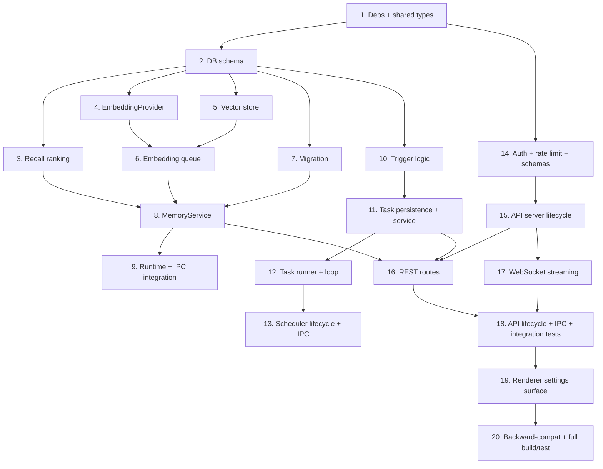

# Implementation Plan

## Overview

This plan implements Phase 1 — Foundation incrementally across three pillars (Memory Layer, Scheduler, Local API). Each task is test-driven where practical, builds on prior tasks, and references the requirements it satisfies. Shared/pure logic (recall ranking, trigger validation, auth) is implemented and unit/property-tested first so it can be verified without Electron. All work is additive and gated behind settings so existing behavior is unchanged when the features are disabled.

## Task Dependency Graph



```json
{
  "waves": [
    { "wave": 1, "tasks": ["1"] },
    { "wave": 2, "tasks": ["2"] },
    { "wave": 3, "tasks": ["3", "4", "5", "7", "10", "14"] },
    { "wave": 4, "tasks": ["6", "11", "15"] },
    { "wave": 5, "tasks": ["8", "12", "16", "17"] },
    { "wave": 6, "tasks": ["9", "13", "18"] },
    { "wave": 7, "tasks": ["19"] },
    { "wave": 8, "tasks": ["20"] }
  ]
}
```

## Tasks

### Pillar 1 — Persistent Cross-Session Memory Layer

- [x] 1. Add dependencies and shared memory types
  - Add `vectra` (vector store), `croner` (scheduler), `ws` (websocket); add `fast-check` as a dev dependency
  - Add Phase 1 type definitions to `src/shared/types/localmind-api.ts` (MemoryRecord, RecallResult, ScheduledTask, Trigger, TaskRun, ApiServerConfig) and the new `window.localmind.memory/scheduler/apiServer` namespaces
  - _Requirements: 17.1_

- [x] 2. Extend the database schema (additive, idempotent)
  - Add `embeddingModel` and `embeddingStatus` columns to the `memories` table in `src/main/db/schema.ts`
  - Add new `scheduled_tasks` and `task_runs` tables
  - Extend `runMigrations()` in `src/main/db/connection.ts` to add the new columns via the existing `PRAGMA table_info` ALTER pattern and create the new tables idempotently
  - _Requirements: 2.1, 16.1, 17.4_

- [x] 3. Implement pure recall ranking functions with unit + property tests
  - Create `src/main/memory/recall.ts`: `cosineSimilarity`, `lexicalScore` (port the existing token-overlap algorithm), `hybridRank`, and `rankAndLimit` (descending score, tie-break by recent createdAt, clamp limit 1..50)
  - Write `recall.test.ts` (Vitest + fast-check) covering Properties 1–4 (disabled exclusion, size bound, ordering, lexical totality)
  - _Requirements: 4.1, 4.3, 4.4, 4.5, 4.7_

- [x] 4. Implement the EmbeddingProvider abstraction
  - Create `src/main/memory/embedding-provider.ts`: Ollama-backed `embed()` via `/api/embeddings`, `isAvailable()`, `isLocal()`, 30s timeout, Privacy_Mode local-only selection
  - _Requirements: 3.4, 3.5, 3.6, 13.3_

- [x] 5. Implement the Vectra vector store wrapper
  - Create `src/main/memory/vector-store.ts`: file-backed index under `userData/memory-vectors/`, `add(id, vector, meta)`, `query(vector, k)`, `delete(id)`, `flush()`
  - _Requirements: 3.3, 5.2, 13.1, 16.1_

- [x] 6. Implement the async embedding queue
  - Create `src/main/memory/embedding-queue.ts`: fire-and-forget queue that embeds content off the chat path, retries up to 3 times, marks `embeddingStatus` present/absent/stale
  - _Requirements: 3.1, 3.2, 3.7, 15.2_

- [x] 7. Implement the one-time migration with idempotency tests
  - Create `src/main/memory/migration.ts`: import App_Store `memories` + `shortTermMemories` into the `memories` table, guarded by `memoryLayerMigrated` flag, deduped by normalized content+source, resumable
  - Write `migration.test.ts` covering Property 5 (idempotency: run 1..3 times → identical set, count equals source)
  - _Requirements: 2.3, 2.4, 2.5_

- [x] 8. Implement the MemoryService facade
  - Create `src/main/memory/memory-service.ts`: `init`, `create`, `update`, `delete`, `setEnabled`, `list`, `recall`, `flush`
  - Enforce write durability (persistDatabase, 5s timeout, rollback on failure, no partial write), content length validation (1..10,000), not-found errors, content durability independent of embeddings
  - Wire create/update to enqueue embedding jobs; recall uses semantic/lexical/hybrid via `recall.ts` with default 2000ms timeout falling back to lexical
  - _Requirements: 1.2, 1.3, 1.4, 1.6, 2.2, 2.8, 3.1, 4.2, 4.6, 4.8, 5.1, 5.2, 5.3, 5.4, 5.6, 5.7, 5.8, 5.9_

- [x] 9. Integrate MemoryService into the agent runtime and IPC
  - Replace `AgentRuntime.queryLexicalMemory()` usage with `MemoryService.recall()` (keep the lexical algorithm as the fallback path); keep the injected system-prompt format unchanged
  - Add `memory:*` IPC handlers in `ipc.ts` via `safeHandle`; expose in preload; keep existing memory handlers intact for backward compatibility
  - _Requirements: 4.1, 17.1, 17.2_

### Pillar 2 — Background Task Scheduler

- [ ] 10. Implement pure trigger logic with unit + property tests
  - Create `src/main/scheduler/trigger.ts`: `validateTrigger` (5-field cron via croner, interval 1..31,536,000, one-time timestamp), `nextRunAt(trigger, from)`
  - Write `trigger.test.ts` (Vitest + fast-check) covering Property 7 (trigger validity)
  - _Requirements: 6.2, 6.3_

- [ ] 11. Implement task persistence and the SchedulerService facade
  - Create `src/main/scheduler/task-registry.ts` (Drizzle CRUD for tasks/runs + retention pruning) and `src/main/scheduler/scheduler-service.ts` (`init`, `register`, `list`, `setEnabled`, `updateTrigger`, `remove`, `listRuns`, `shutdown`)
  - Enforce unique ids stable across restarts, not-found errors, invalid-trigger rejection on update, shutdown persistence within 5s
  - _Requirements: 6.1, 6.4, 6.5, 8.1, 8.2, 8.3, 8.4, 8.5, 8.6, 8.7, 8.8, 16.4_

- [ ] 12. Implement the task runner and evaluation loop with failure-isolation tests
  - Create `src/main/scheduler/task-runner.ts` (executes a TaskType, produces a Task_Run; routes LLM tasks through `llmRouter` honoring Privacy_Mode) and the `setInterval` tick loop (≤60s) with `setImmediate` dispatch
  - Implement startup catch-up for elapsed triggers and one-time at-most-once semantics
  - Write `scheduler-service.test.ts` covering Properties 8 (one-time at most once) and 9 (failure isolation), plus catch-up integration
  - _Requirements: 7.1, 7.2, 7.3, 7.4, 7.5, 7.6, 7.7, 13.4, 15.3_

- [ ] 13. Wire the Scheduler into lifecycle and IPC
  - Initialize `SchedulerService` in `index.ts` startup and call `shutdown()` on `before-quit`; add `scheduler:*` IPC handlers + preload bindings
  - _Requirements: 6.4, 8.8, 16.3_

### Pillar 3 — Local REST/WebSocket API

- [ ] 14. Implement auth, rate limiting, and request schemas with unit tests
  - Create `src/main/api/auth.ts` (bearer token, constant-time compare, origin allow-list, token generate/regenerate stored in Secrets_Store, never logged), `src/main/api/rate-limiter.ts` (token bucket), `src/main/api/schemas.ts` (zod)
  - Write `auth.test.ts` (Property 10: total/constant-time token compare) and `rate-limiter.test.ts`
  - _Requirements: 10.1, 10.4, 10.5, 10.6, 10.7, 10.8, 14.1, 14.3, 14.4_

- [ ] 15. Implement the API server lifecycle
  - Create `src/main/api/api-server.ts`: Node `http` + `ws`, loopback bind, port-range validation (1024..65535), port-in-use handling, write `{host,port}` to appStore on listen, graceful stop with ≤5s drain
  - _Requirements: 9.1, 9.2, 9.3, 9.4, 9.5, 9.6, 9.7, 13.2_

- [ ] 16. Implement REST routes
  - Create `src/main/api/rest-routes.ts`: chat completions (through `llmRouter`, Privacy_Mode parity), memory CRUD (MemoryService), task ops (SchedulerService); every response in `IPCResponse` shape; auth short-circuit; 400/401/403/413/429 handling
  - _Requirements: 11.1, 11.2, 11.3, 11.4, 11.5, 11.6, 11.7_

- [ ] 17. Implement WebSocket streaming
  - Create `src/main/api/ws-handler.ts`: `/v1/stream` authenticated at handshake; `chat.start`/`chat.cancel`; emit ordered `chunk`/`done`(usage)/`error`; reuse existing `AbortController` cancellation; abort on connection loss
  - _Requirements: 12.1, 12.2, 12.3, 12.4, 12.5, 12.6, 12.7_

- [ ] 18. Wire the API server into lifecycle and IPC, and add integration tests
  - Start `ApiServer` during startup when enabled; stop on `before-quit`; add `apiServer:*` IPC (status, token regenerate) + preload bindings
  - Write API integration tests (401 without token, success with token, 403 origin, 413 oversized, 429 rate limit, WS chunk→done ordering and cancel)
  - _Requirements: 9.1, 9.6, 10.2, 10.3, 11.1, 11.2, 11.3, 11.4, 11.5, 12.1, 12.4, 12.6_

### Finalization

- [ ] 19. Add a minimal renderer Settings surface for the foundation features
  - Add toggles/status for the local API (enable, port, token regenerate, shown host:port), memory config (recall limit/embedding model), and a scheduled-tasks list view
  - _Requirements: 9.3, 10.5_

- [ ] 20. Verify backward compatibility and run full build + test suite
  - Confirm `npm run build` passes and existing chat/memory/settings behavior is unchanged with the new features disabled; run `npm run test:unit`
  - _Requirements: 17.1, 17.3, 17.4_

## Notes

- **Test-first ordering:** Pure modules (recall, trigger, auth) are built and tested before the stateful services that consume them, so the Correctness Properties from the design are verified early with `fast-check`.
- **Additive & gated:** All DB changes use the existing idempotent ALTER/CREATE pattern, and all subsystems are off by default in settings — existing chat/memory/settings behavior stays unchanged (Req 17).
- **Fault isolation:** Each subsystem `init()` is wrapped so a failure logs and reports but does not block the others or app startup.
- **Verification:** Run `npm run test:unit` after each test-bearing task and `npm run build` before finalization.
- New runtime deps introduced: `vectra`, `croner`, `ws` (+ `fast-check` dev). Confirm before installing if offline.
